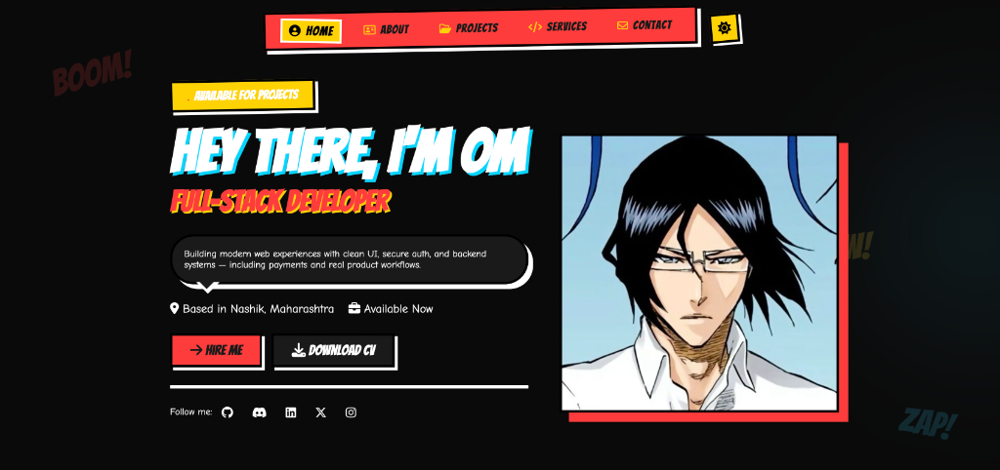

# 💥 OM CODES - Comic Style Portfolio 💥



<p align="center">
  <a href="https://github.com/omrajputt369-byte" target="_blank">
    
  </a>
  <a href="https://comicsportfolio.netlify.app/" target="_blank">
    
  </a>
</p>

Welcome to the **OM CODES** repository! This is a personal portfolio website designed with a unique **Comic Book / Pop Art** aesthetic (Spider-Verse inspired). It showcases my skills, projects, and expertise as a **Full-Stack (MERN) Developer**.

## 🔗 Live Demo

You can view the live project here: [https://comicsportfolio.netlify.app/](https://comicsportfolio.netlify.app/)

## 🌟 Features

### 🎨 Design & Visual
- **Comic Book Aesthetic**: Vibrant colors (Yellow, Red, Cyan), bold typography (Bangers font), and halftone patterns
- **Dark Mode**: Sleek dark theme toggle for comfortable night-time viewing
- **Interactive Elements**: Floating comic words ("BOOM!", "ZAP!"), "Top Secret" stamps, and tape effects
- **Custom Animations**:
  - Retro comic loading bar preloader
  - Smooth scroll reveal animations with slide-in effects
  - Dynamic hover effects on buttons, cards, and links

### 📱 Responsive Design
- **Fully Mobile-Optimized**: Seamless adaptation across all devices
- **Three Breakpoints**:
  - Desktop (default)
  - Tablet (900px and below)
  - Mobile (600px and below)
  - Small phones (400px and below)
- **Touch-Friendly**: 44px minimum touch targets following Apple/Google standards
- **Sticky Navigation**: Header stays visible while scrolling on mobile
- **Optimized Typography**: Responsive font scaling for all screen sizes

### 💼 Portfolio Showcase
**Featured Projects** with working GitHub and live demo links:
1. **MinimalMart** - E-commerce UI with clean shopping experience
2. **MangaVerse Portfolio** - Manga-themed portfolio with storytelling design
3. **iPhone Showcase Website** - Apple-inspired product site with cinematic animations
4. **Blog Website** - Modern blog interface for fast reading
5. **ArcadeX** - Full-stack game marketplace with payment integration
6. **TaskForge** - Full-stack task manager with authentication and CRUD features

### 🛠️ Technical Highlights
- **Profile**: Full-Stack (MERN) Developer
- **Tech Stack Display**:
  - Frontend: React, Vite, Tailwind CSS, JavaScript
  - Backend: Node.js, Express, MongoDB, REST APIs
  - Features: Authentication, Payment Integration (Razorpay), Responsive UI, Animations
- **Real Project Experience**: Auth systems, REST APIs, MongoDB workflows, payment integration

### ✨ User Experience
- **Smooth Interactions**: Optimized animations and transitions
- **Clean Navigation**: Easy-to-use menu with active state indicators
- **Professional Presentation**: Well-organized sections (Home, About, Projects, Services, Contact)
- **Social Integration**: Direct links to GitHub, Discord, LinkedIn, Twitter, and Instagram

## 🛠️ Technologies Used

- **HTML5**: Semantic structure with SEO-friendly meta tags
- **CSS3**: Custom properties (CSS variables), Flexbox, Grid, and advanced animations
- **JavaScript (ES6+)**: DOM manipulation, Intersection Observer API, and theme toggle logic
- **Font Awesome 6.5.0**: Icons for social media and UI elements
- **Google Fonts**: 'Bangers' for headers and 'Comic Neue' for body text

## 📂 Project Structure

```bash
Comics-Style-Portfolio/
├── images/                    # Project screenshots and profile images
│   ├── profile.JPG           # Profile photo
│   ├── showcase.jpg          # MangaVerse Portfolio preview
│   ├── skincare product.jpg  # MinimalMart preview
│   ├── apple website.png     # iPhone Showcase preview
│   ├── blogwebsite.jpg       # Blog Website preview
│   ├── game.png              # ArcadeX preview
│   └── Task manager app.png  # TaskForge preview
├── index.html                 # Main HTML structure
├── style.css                  # All styles and responsive design
├── script.js                  # Interactions and animations logic
└── README.md                  # Project documentation
```

## 🚀 How to Run

1. Clone this repository:
   ```bash
   git clone https://github.com/omrajputt369-byte/Comic-style-portfolio.git
   ```
2. Navigate to the project folder:
   ```bash
   cd Comic-style-portfolio
   ```
3. Open `index.html` in your browser (or use Live Server extension in VS Code)

## 🎨 Color Palette

- **Yellow**: `#FFD200` - Primary accent color
- **Red**: `#ED1C24` - CTA and highlights
- **Cyan**: `#00AEEF` - Secondary accent
- **Black**: `#000000` - Text and borders
- **Paper White**: `#FDFDFD` - Background (light mode)

## 📱 Responsive Breakpoints

```css
/* Tablet */
@media (max-width: 900px)

/* Mobile Phones */
@media (max-width: 600px)

/* Small Phones */
@media (max-width: 400px)
```

## 📧 Contact

- **Email**: omrajputt369@gmail.com
- **GitHub**: [omrajputt369-byte](https://github.com/omrajputt369-byte)
- **LinkedIn**: [om-rajput369](https://www.linkedin.com/in/om-rajput369)
- **Twitter**: [@k4bir17](https://x.com/k4bir17?s=21)
- **Instagram**: [@omrajputt55](https://www.instagram.com/omrajputt55)
- **Discord**: [kabir.17](https://discord.com/users/kabir.17)

## 🌐 Project Links

### Featured Projects
- **MinimalMart**: [GitHub](https://github.com/omrajputt369-byte/skincarewebsite)
- **MangaVerse Portfolio**: [GitHub](https://github.com/omrajputt369-byte/mangastyleportfolio) | [Live](https://modernmangaportfolio.netlify.app/)
- **iPhone Showcase**: [GitHub](https://github.com/omrajputt369-byte/applewebsite)
- **Blog Website**: [GitHub](https://github.com/omrajputt369-byte/blogwebsite)
- **ArcadeX**: [GitHub](https://github.com/omrajputt369-byte/game-desktop) | [Live](https://gamezx.netlify.app)
- **TaskForge**: [GitHub](https://github.com/omrajputt369-byte/orbit-ai-task-manager) | [Live](https://orbitaitaskmanager.netlify.app)

---

© 2026 OM CODES. All Rights Reserved  
**Developed by OM** - Full-Stack (MERN) Developer

*Building modern web experiences with clean UI, secure auth, and backend systems — including payments and real product workflows.*
